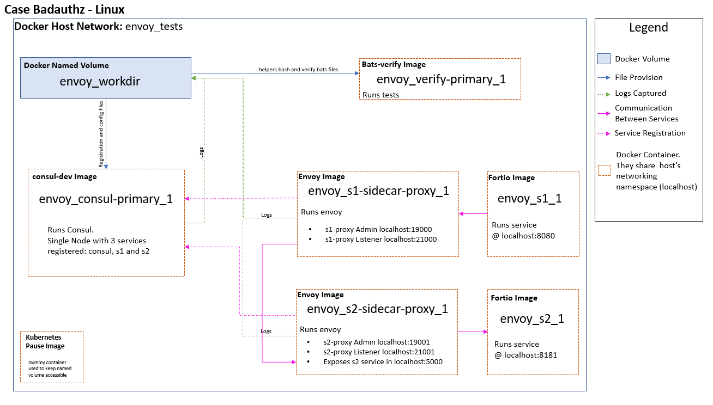
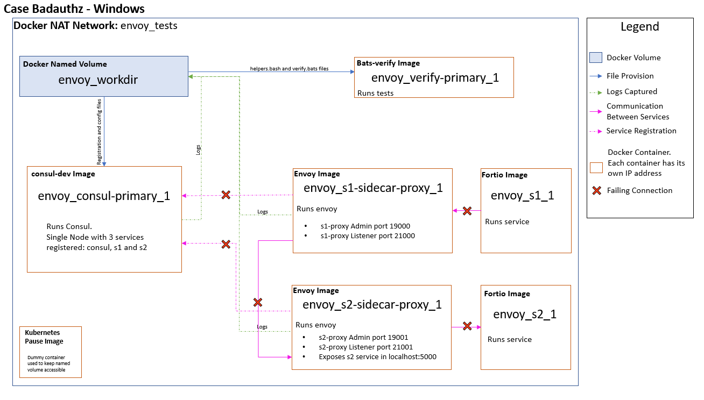
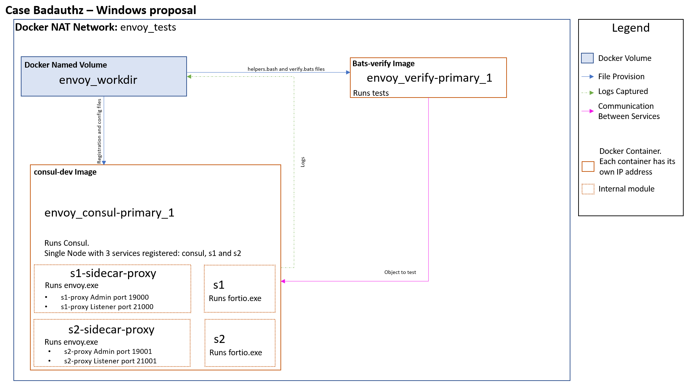

# Test architecture update proposal on Windows

## Description of the problem

The tests migration’s from Linux env to Windows env was carried out. This brought a fundamental difference between both architectures. In the Linux environment, a Docker network of the Host type is set up. The operation of this type of network is that (at the network level) the separations between the different containers are eliminated. This way all containers share the localhost of the host. What does this mean? that all tests and configuration files point to localhost regardless of whether they are in different containers.
What happens in Windows? Host networks are not supported. In Docker networks for Windows each container is a separate unit with its own addresses. This impacts not only the execution of the tests, but all the configurations require an update since in most cases they would point to a localhost that will not have the information because it is in another container.

### Linux network diagram



### Windows network diagram



### Diagram of the proposed network



### Windows docker containers

#### Currently


#### Proposed


## Important items to change

* Unification of environment containers
* Changes when creating services
* Changes when starting sidecar
* Change in the way of creating the Workdir Volume

## Advantage

* More sensitive architecture
* Fewer images and Containers
* Shorter response time and test completion

## What the changes consist of

### Unification of environment containers

Only two containers will be mounted: *consul-primary* and *verify-primary*.
The *consul-primary* container brings together the architecture to be tested (Consult, services, instances...)
verify-primary is the container where the tests are run from. In the new architecture all these tests would point to *consul-primary*, simplifying their logic.

### Changes when creating services

The functions that create the services would receive a change. Today, every time a service is created, a Fortio container is started that simulates said service. In the proposal, those functions would execute a command in the *consul-primary* container with the listening ports for each service.

Example s1:

```
fortio server -http-port ":8080" -grpc-port ":8079"
```

Example s2:

```
fortio server -http-port ":8181" -grpc-port ":8179"
```

### Changes when starting sidecar

At the time of starting the sidecar of the services until now, an Envoy containment was mounted. The proposal runs this Envoy inside consul-primary. The function would be modified so that instead of raising the container, it executes commands of the type:

```
C:\envoy\envoy -c C:\workdir\primary\envoy\s1-bootstrap.json -l trace --disable-hot-restart --drain-time-s 1
```

### Change in the way of creating the Workdir Volume

To avoid the current process in windows of lowering the volume and bringing it back online every time an update is required, it is recommended to change the volume type to a dynamic one.

## Proof of Concept

A Proof of Concept (POC) was carried out by unifying the containers. After having a mounted image of Consul, Envoy and Fortio the Envoy and fortio services were started manually. In this way we already have a functional Consul with green health status.


By script, the Bats container is executed to perform the Badauthz test. For this to work, the only change made is an intermediate function within the helpers that redirects localhost requests to the *consul-primary* address.

```
docker.exe run --name envoy_verify-primary_1 -t -e TINI_SUBREAPER=1 -e ENVOY_VERSION -v envoy_workdir:C:\workdir  --pid=host --net=envoy-tests bats-verify --pretty primary/bats
```


The tests are executed and everything works without having to modify the general structure of each test or the associated configuration files.


